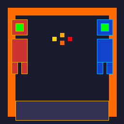
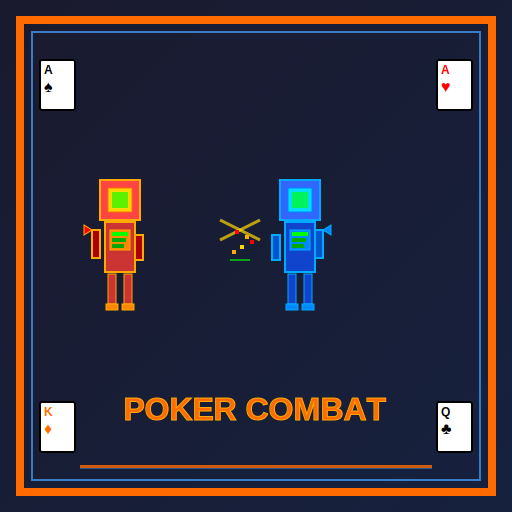
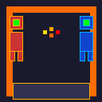

# 🎮 Guía de Implementación de Iconos - Poker Combat Bot

## Archivos de Icono Creados

Se han generado los siguientes archivos de icono en estilo retro pixel art:

### 📦 Archivos Disponibles

| Archivo | Tamaño | Uso |
|---------|--------|-----|
| `favicon.ico` | 32x32px | Para la pestaña del navegador |
| `icon_16x16.png` | 16x16px | Favicon alternativo |
| `icon_32x32.png` | 32x32px | Navegador, bookmarks |
| `icon_64x64.png` | 64x64px | Iconos en listas |
| `icon_128x128.png` | 128x128px | App store, escritorio |
| `icon_256x256.png` | 256x256px | Logo grande, impresión |
| `icon_poker_combat_retro.svg` | Escalable | Logo vectorial (mejor calidad) |

---

## 🚀 Cómo Implementar en tu Web

### 1. Favicon en HTML

Agrega esto en la sección `<head>` de tu HTML:

```html
<!-- Favicon para navegador -->
<link rel="icon" type="image/x-icon" href="favicon.ico">

<!-- Alternativas para diferentes navegadores -->
<link rel="apple-touch-icon" href="icon_256x256.png">
<link rel="icon" type="image/png" href="icon_32x32.png">
```

### 2. Logo Principal en la Web

Para mostrar el logo como imagen principal:

```html
<!-- Logo grande (retro) -->


<!-- O si prefieres el SVG escalable (mejor para web moderna) -->

```

### 3. Favicon en Margen

Para que aparezca automáticamente en la pestaña del navegador, coloca `favicon.ico` en la raíz de tu servidor web:

```
/
├── index.html
├── favicon.ico  ← Aquí
└── ...
```

### 4. Manifest para Aplicación Web

Si quieres que funcione como Progressive Web App:

```json
// manifest.json
{
  "name": "Poker Combat Bot",
  "short_name": "PCB",
  "description": "Juego de estrategia con construcción de mechas y combate táctico",
  "start_url": "/",
  "display": "standalone",
  "background_color": "#1a1a2e",
  "theme_color": "#FF6B00",
  "icons": [
    {
      "src": "icon_16x16.png",
      "sizes": "16x16",
      "type": "image/png"
    },
    {
      "src": "icon_32x32.png",
      "sizes": "32x32",
      "type": "image/png"
    },
    {
      "src": "icon_64x64.png",
      "sizes": "64x64",
      "type": "image/png"
    },
    {
      "src": "icon_128x128.png",
      "sizes": "128x128",
      "type": "image/png"
    },
    {
      "src": "icon_256x256.png",
      "sizes": "256x256",
      "type": "image/png"
    }
  ]
}
```

Luego en HTML:
```html
<link rel="manifest" href="manifest.json">
```

---

## 🎨 Características del Icono

✅ **Estilo Retro Pixel Art**
- Inspirado en arcades de los 80s/90s
- Colores vibrantes nostálgicos

✅ **Dos Mechas en Combate**
- Mecha ROJO (izquierda) - Ataque
- Mecha AZUL (derecha) - Defensa
- Efecto de chispas en el centro

✅ **Elementos de Póker**
- Cartas incorporadas en el diseño
- Símbolos de picas, corazones, diamantes, tréboles

✅ **Versátil**
- Escalable (SVG vector)
- Compatible con todos los navegadores
- Funciona en favicon, logo y app icon

✅ **Colores Corporativos**
- Naranja (#FF6B00) - Energía y acción
- Azul (#3A7BC8) - Estrategia y tecnología
- Fondos oscuros - Estilo retro cockpit

---

## 💡 Recomendaciones de Uso

### Para Página Principal
```html
<div class="hero-section">
  
  <h1>Poker Combat Bot</h1>
  <p>Construye. Estrategia. Combate. Victoria.</p>
</div>
```

### Para Botones/Enlaces
```html
<!-- Pequeño icono junto al nombre -->
<a href="/" class="nav-logo">
  
  Poker Combat Bot
</a>
```

### Para Redes Sociales
- Usa `icon_256x256.png` como imagen de perfil
- Usa `icon_512x512.png` (si necesitas crear) para compartir en redes

### Para Aplicación Móvil
```html
<!-- Apple -->
<link rel="apple-touch-icon" href="icon_128x128.png">
<!-- Android -->
<link rel="icon" href="icon_128x128.png" type="image/png">
```

---

## 📐 Dimensiones Recomendadas por Contexto

| Contexto | Tamaño Recomendado | Archivo |
|----------|-------------------|---------|
| Favicon | 16x16 / 32x32 | favicon.ico |
| Página web pequeña | 64x64 | icon_64x64.png |
| Página web mediana | 128x128 - 256x256 | icon_128x128.png o .svg |
| Logo grande | 256x512px | icon_256x256.png o .svg |
| App store | 128x128 | icon_128x128.png |
| Redes sociales | 256x256 | icon_256x256.png |
| Impresión | .svg | icon_poker_combat_retro.svg |

---

## 🔧 Personalización Adicional

Si deseas modificar los iconos:

### Opción 1: Editar SVG
El archivo `icon_poker_combat_retro.svg` es un vector editable. Puedes:
- Cambiar colores editando los valores hex (#FF6B00, #3A7BC8, etc.)
- Modificar formas y proporciones
- Añadir elementos nuevos
- Abrirlo en Illustrator, Inkscape o editores online

### Opción 2: Regenerar PNGs
Si cambias el SVG, puedes reconvertir a PNG usando:
```bash
# Convertir SVG a PNG (requiere librería de conversión)
convert -density 300 icon_poker_combat_retro.svg -quality 90 icon_256x256.png
```

---

## ✨ Ejemplo HTML Completo

```html
<!DOCTYPE html>
<html lang="es">
<head>
    <meta charset="UTF-8">
    <meta name="viewport" content="width=device-width, initial-scale=1.0">
    <title>Poker Combat Bot</title>

    <!-- Favicon -->
    <link rel="icon" type="image/x-icon" href="favicon.ico">
    <link rel="apple-touch-icon" href="icon_128x128.png">

    <!-- Manifest para PWA -->
    <link rel="manifest" href="manifest.json">

    <style>
        body {
            background: linear-gradient(135deg, #1a1a2e 0%, #16213e 100%);
            color: white;
            font-family: Arial, sans-serif;
            margin: 0;
            padding: 20px;
        }

        .header {
            display: flex;
            align-items: center;
            gap: 20px;
            border-bottom: 3px solid #FF6B00;
            padding-bottom: 20px;
        }

        .logo {
            width: 80px;
            height: 80px;
            filter: drop-shadow(0 0 10px rgba(255, 107, 0, 0.5));
        }

        .header h1 {
            margin: 0;
            color: #FF6B00;
            text-shadow: 2px 2px 4px rgba(0, 0, 0, 0.5);
        }
    </style>
</head>
<body>
    <div class="header">
        
        <div>
            <h1>Poker Combat Bot</h1>
            <p>Construye. Estrategia. Combate. Victoria.</p>
        </div>
    </div>

    <main>
        <!-- Tu contenido aquí -->
    </main>
</body>
</html>
```

---

## 🎯 Checklist de Implementación

- [ ] Colocar `favicon.ico` en la raíz del servidor
- [ ] Agregar tag `<link rel="icon">` en HTML
- [ ] Crear `manifest.json` para PWA
- [ ] Usar icono correcto según contexto
- [ ] Optimizar imágenes para web (compresión)
- [ ] Probar en diferentes navegadores
- [ ] Verificar en teléfono móvil
- [ ] Compartir en redes sociales

---

## 📞 Notas Finales

- Los iconos están optimizados para web
- Mantienen la calidad retro a cualquier tamaño
- SVG es escalable infinitamente sin pérdida de calidad
- PNGs están listos para usar inmediatamente

¡Ahora tu Poker Combat Bot tendrá una identidad visual retro y atractiva! 🚀
