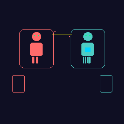

# 🎨 Iconos Modernos Glassmorphism - Poker Combat Bot

**Estilo:** Glassmorphism contemporáneo
**Tema:** Robots en combate + Cartas de póker
**Uso:** App moderna, interfaz web, elementos de UI

---

## 📦 Archivos Creados

### Icono Principal (Robots en Combate)
- `icon_modern_glassmorphism.svg` - Vector escalable
- `icon_modern_64x64.png` - Pequeño
- `icon_modern_128x128.png` - Mediano
- `icon_modern_256x256.png` - Grande
- `icon_modern_512x512.png` - Extra grande

### Serie de Iconos Individuales
- `icons_modern_series.svg` - 9 iconos en una imagen

---

## 🎮 La Serie de 9 Iconos

### 1. ⚔️ **ATAQUE** (Punño/Golpe)
**Uso:** Botón de ataque, modo ofensivo, poder ofensivo
- Color: Rojo gradiente (#ff6b6b → #ff0040)
- Elemento: Puño con líneas de impacto
- Emoción: Agresivo, dinámico, fuerza

### 2. 🛡️ **DEFENSA** (Escudo)
**Uso:** Botón de defensa, modo defensivo, armadura
- Color: Azul gradiente (#4ecdc4 → #00d4ff)
- Elemento: Escudo geométrico
- Emoción: Protección, resistencia, estabilidad

### 3. 🔧 **CONSTRUCCIÓN** (Engranaje)
**Uso:** Fase de build, montaje de mecha, configuración
- Color: Púrpura gradiente (#a855f7 → #d946ef)
- Elemento: Engranaje con dientes animados
- Emoción: Técnico, preciso, creativo

### 4. ♥️ **CARTAS/POKER** (As de Corazones)
**Uso:** Inventario de cartas, recursos, mano del jugador
- Color: Oro/Blanco (#fbbf24)
- Elemento: Carta estilizada con símbolo
- Emoción: Valor, importancia, suerte

### 5. ⚡ **VELOCIDAD/TURNOS** (Reloj Dinámico)
**Uso:** Contador de turnos, velocidad de acción, tiempo
- Color: Azul (#3b82f6)
- Elemento: Reloj con líneas de movimiento
- Emoción: Rápido, dinámico, urgencia

### 6. 👑 **VICTORIA/RANKING** (Corona)
**Uso:** Sistema de victorias, ranking, logros
- Color: Oro (#fbbf24)
- Elemento: Corona con joyas
- Emoción: Éxito, supremacía, maestría

### 7. ⚡ **ENERGÍA/PODER** (Rayo)
**Uso:** Poder especial, energía del mecha, ataque crítico
- Color: Amarillo (#ffff00)
- Elemento: Rayo/Trueno con aura
- Emoción: Potencia, voltaje, energía bruta

### 8. 🧠 **ESTRATEGIA** (Cerebro)
**Uso:** Modo estratégico, habilidades táticas, inteligencia
- Color: Púrpura (#a855f7)
- Elemento: Cerebro estilizado con conexiones
- Emoción: Intelecto, cálculo, maestría

### 9. ⭐ **BONUS/MULTIPLICADOR** (Estrella)
**Uso:** Poder especial, multiplicadores, bonificaciones
- Color: Oro (#fbbf24)
- Elemento: Estrella brillante con partículas
- Emoción: Especial, mágico, excepcional

---

## 🎨 Características de Diseño

### Glassmorphism Moderno
✅ Efecto de vidrio translúcido
✅ Bordes suavizados (border-radius)
✅ Gradientes suaves y naturales
✅ Capas de transparencia
✅ Brillo y reflexiones sutiles

### Colores Corporativos Extendidos
- **Rojo:** #ff6b6b → #ff0040 (Ataque, agresión)
- **Azul:** #4ecdc4 → #00d4ff (Defensa, precisión)
- **Púrpura:** #a855f7 → #d946ef (Estrategia, construcción)
- **Oro:** #fbbf24 → #f59e0b (Valor, bonificaciones)
- **Verde LED:** #00ff88 (Energía, actividad)
- **Amarillo:** #ffff00 (Poder especial)

### Elementos Visuales
- Efecto de brillo (glow filter)
- Sombras suaves
- Líneas dinámicas para movimiento
- Partículas energéticas
- Auras alrededor de elementos principales

---

## 💻 Cómo Usar en tu App Web

### HTML + CSS Moderno

```html
<!-- Importar iconos -->


<!-- O usar SVG directamente (mejor para web) -->
<object data="icon_modern_glassmorphism.svg" type="image/svg+xml" class="logo-svg"></object>
```

### CSS para Efecto Glassmorphism en tu UI

```css
/* Contenedor glassmorphism genérico */
.glass-container {
  background: rgba(255, 255, 255, 0.05);
  backdrop-filter: blur(10px);
  border: 1px solid rgba(255, 255, 255, 0.1);
  border-radius: 16px;
  box-shadow: 0 4px 30px rgba(0, 0, 0, 0.3);
}

/* Botón de ataque (con icono rojo) */
.btn-attack {
  background: linear-gradient(135deg, #ff6b6b, #ff0040);
  color: white;
  border: none;
  border-radius: 12px;
  padding: 12px 24px;
  font-weight: bold;
  cursor: pointer;
  box-shadow: 0 4px 15px rgba(255, 107, 107, 0.3);
  transition: all 0.3s ease;
}

.btn-attack:hover {
  box-shadow: 0 6px 25px rgba(255, 107, 107, 0.5);
  transform: translateY(-2px);
}

/* Botón de defensa (con icono azul) */
.btn-defend {
  background: linear-gradient(135deg, #4ecdc4, #00d4ff);
  /* mismo estilos que btn-attack */
}

/* Botón de construcción (con icono púrpura) */
.btn-build {
  background: linear-gradient(135deg, #a855f7, #d946ef);
  /* mismo estilos que btn-attack */
}
```

### Usar Iconos Individuales

```html
<!-- En tu UI de game -->
<div class="game-interface">
  <!-- Panel de ataque -->
  <div class="action-panel glass-container">
    <svg class="icon-small" viewBox="0 0 212 212">
      <!-- Contenido del icono de ataque -->
    </svg>
    <span>Atacar</span>
  </div>

  <!-- Panel de defensa -->
  <div class="action-panel glass-container">
    <svg class="icon-small" viewBox="0 0 212 212">
      <!-- Contenido del icono de defensa -->
    </svg>
    <span>Defender</span>
  </div>

  <!-- Medidor de energía con icono de rayo -->
  <div class="energy-bar glass-container">
    <svg class="icon-tiny" viewBox="0 0 212 212">
      <!-- Contenido del icono de energía -->
    </svg>
    <div class="bar-fill"></div>
  </div>
</div>
```

---

## 📱 Responsividad

| Contexto | Tamaño Icono | Archivo |
|----------|--------------|---------|
| Favicon pequeño | 64×64 | icon_modern_64x64.png |
| Botones UI | 64×64 - 128×128 | icon_modern_128x128.png |
| Card elementos | 128×128 | icon_modern_128x128.png |
| Banner web | 256×256 | icon_modern_256x256.png |
| Logo grande | 512×512 | icon_modern_512x512.png |
| Impresión | SVG | icon_modern_glassmorphism.svg |

---

## 🎯 Casos de Uso Específicos

### Panel de Control de Combate
```
┌─────────────────────────┐
│  ⚔️ ATACAR   |  🛡️ DEFENDER  │
│  ⚡ ENERGÍA |  👑 VICTORIA   │
└─────────────────────────┘
```

### Barra de Recursos
```
🛡️ Defensa: ▓▓▓▓░░░░░░ 40%
⚔️ Ataque:  ▓▓▓▓▓▓▓░░░ 70%
🔧 Build:   ▓▓▓▓▓▓▓▓▓░ 90%
```

### Menú de Construcción
```
Módulos:
┌──────────────────┐
│ 🧠 Estrategia   │
│ ⚡ Energía       │
│ 👑 Bonus        │
│ ⭐ Especial     │
└──────────────────┘
```

---

## ✨ Ventajas del Diseño Glassmorphism

✅ **Moderno y contemporáneo** - Sigue tendencias 2024
✅ **Elegante y sofisticado** - Se ve premium
✅ **Versátil** - Funciona en fondos claros y oscuros
✅ **Accesible** - Alto contraste para legibilidad
✅ **Escalable** - SVG = calidad en cualquier tamaño
✅ **Profesional** - Ideal para apps modernas

---

## 🔧 Personalización

### Cambiar Colores
Los archivos SVG pueden editarse directamente. Busca:
- `#ff6b6b` - Para cambiar rojo
- `#4ecdc4` - Para cambiar azul
- `#a855f7` - Para cambiar púrpura
- `#fbbf24` - Para cambiar oro

### Añadir Más Iconos
La estructura en `icons_modern_series.svg` facilita:
1. Copiar un grupo `<g>` existente
2. Cambiar el `transform="translate()"`
3. Modificar colores y formas
4. Ajustar el viewBox si es necesario

---

## 📊 Especificaciones Técnicas

**Formato:** SVG + PNG
**Resolución:** 64×64 a 512×512 px
**Modo Color:** RGBA con transparencia
**Filtros:** Gaussian Blur, Glow effects
**Tipografía:** Arial/Sans-serif (solo en cartas)
**Stroke Width:** Escalable según tamaño

---

## 🎬 Animaciones Sugeridas

Para hacer los iconos más dinámicos en tu app:

```css
@keyframes pulse {
  0%, 100% { opacity: 1; }
  50% { opacity: 0.7; }
}

@keyframes glow-animation {
  0% { filter: drop-shadow(0 0 5px rgba(255, 107, 107, 0.5)); }
  50% { filter: drop-shadow(0 0 20px rgba(255, 107, 107, 0.8)); }
  100% { filter: drop-shadow(0 0 5px rgba(255, 107, 107, 0.5)); }
}

.icon-attack:hover {
  animation: glow-animation 1s ease-in-out infinite;
}

.icon-energy {
  animation: pulse 2s ease-in-out infinite;
}
```

---

## 🎨 Compatibilidad

✅ Chrome/Edge (soporte total)
✅ Firefox (soporte total)
✅ Safari (soporte total)
✅ Mobile browsers (soporte total)
✅ IE 11 (fallback a PNG)

---

**Serie completa lista para integrar en tu app moderna. ¡Disfruta del diseño Glassmorphism!** ✨
